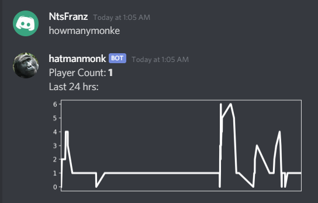

# Player Count
A web server with a sqlite3 database and a discord bot to upload and retrieve current player counts for a game.
The game uploads the current count to a database, and the discord bot retrieves the count from that database. The database server and the discord bot do not have to be on the same computer - communication happens through GET and POST requests.

## Setup Instructions
 - Install the python packages using the `requirements.txt` file (run `pip install -r requirements.txt` (preferably with a venv))

### Flask database server (`flask_db.py`)
The server is where the databse of player counts is stored. Player counts are uploaded by the game clients and counts are retrieved from the server by the discord bot.

#### Setup:
 - Run `./run_flask.sh` to run the Flask server locally
 - Set this up on a server using something like gunicorn
 - Make sure to have a static IP or use a ddns service

The flask server has 3 routes:
#### `/update_monke_count` [POST]
 - Use this to upload the current number of players from Unity using a POST request
	
#### `/how_many_monke` [GET]
 This is used in the discord bot to get the last count of players
 Example return data:
 ```json
{
    "game_name": "none",
    "game_version": "none",
    "player_count": 2,
    "room_name": "none",
    "timestamp": "2021-01-11 05:52:47"
}
```

#### `/how_many_monke_graph` [GET]
This is used in the discord bot to get all the counts of users in the last 24 hours. The graph is generated in the discord bot code.
Example return data:
```json
[
    {
        "game_name": "none",
        "game_version": "none",
        "player_count": 2,
        "room_name": "none",
        "timestamp": "2021-01-11 05:52:47"
    },
    {
        "game_name": "none",
        "game_version": "none",
        "player_count": 1,
        "room_name": "none",
        "timestamp": "2021-01-11 05:52:32"
    },
    {
        "game_name": "none",
        "game_version": "none",
        "player_count": 1,
        "room_name": "none",
        "timestamp": "2021-01-11 05:52:07"
    }
]
```

### Discord bot (`discord_bot.py`)


In the provided script, variations of `howmanymonke` respond with a graph of the last 24 hours of player counts, and `!usercount` responds with a simpler instantaneous count.

To run the bot, make sure you have the requirements installed through `requirements.txt`, then run `python discord_bot.py`.
Make sure to fill in the variables near the top of the script with the appropriate values. If you have the db server on a separate computer, enter those urls, and enter your discord bot client id from the Discord developer portal.